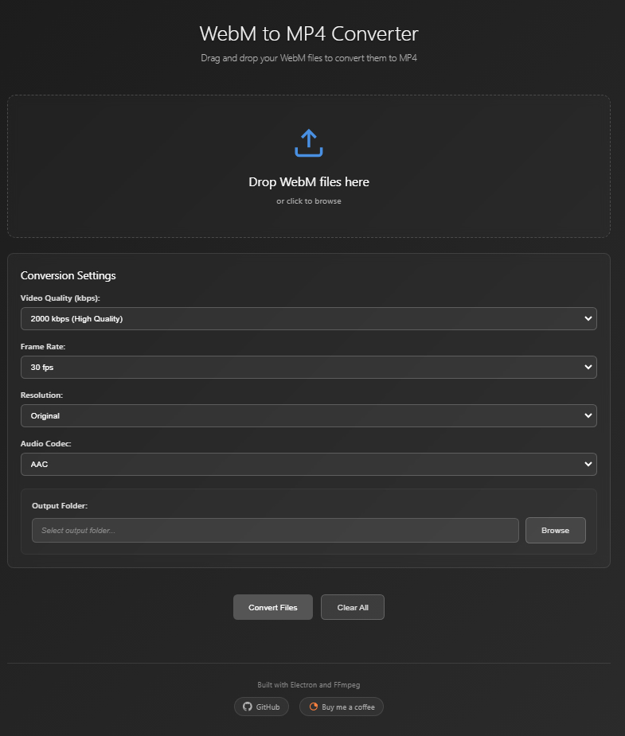

# WebM to MP4 Converter

Convert WebM files to MP4 with drag-and-drop simplicity.


## Screenshot



## Features

- **Drag & drop** WebM files to convert
- **Batch processing** - convert multiple files at once
- **Customizable settings** - quality, frame rate, resolution, audio codec
- **File overwrite protection** - asks before replacing existing files
- **Real-time progress** - see frames processed, speed, and file size
- **Cross-platform** - Windows, macOS, and Linux
- **No internet required** - works completely offline

## Installation

### Download Release (Recommended)

1. Go to the [Releases page](../../releases)
2. Download the package for your operating system:
   - `WebM to MP4 Converter-X.X.X-Windows.zip` for Windows
   - `WebM to MP4 Converter-X.X.X-x64.dmg` for macOS (Intel)
   - `WebM to MP4 Converter-X.X.X-arm64.dmg` for macOS (Apple Silicon)
   - `WebM to MP4 Converter-X.X.X-x64.AppImage` for Linux
3. Extract (Windows) or install (macOS/Linux) and launch the app

**No additional software needed** - FFmpeg is bundled with the release.

### Build from Source

**Requirements:** Node.js 18+ and FFmpeg

```bash
git clone https://github.com/yourusername/webm-to-mp4.git
cd webm-to-mp4
npm install
npm start
```

## Usage

1. **Add files** - Drag WebM files into the app or click to browse
2. **Choose output folder** - Click "Browse" to select where files will be saved
3. **Adjust settings** (optional):
   - Video quality: 500-5000 kbps (default: 2000 kbps high quality)
   - Frame rate: 24/30/60 fps (default: 30 fps)
   - Resolution: Original/480p/720p/1080p (default: original)
   - Audio: AAC/MP3/Copy original (default: AAC)
4. **Click "Convert Files"** - Watch real-time progress and wait for completion

## Building Releases

To create distributable executables:

```bash
npm install
npm run build-win      # Windows ZIP package
npm run build-mac      # macOS DMG (requires macOS)
npm run build-linux    # Linux AppImage
npm run build-all      # All platforms (requires appropriate OS)
```

**Note:** Building for macOS requires running on macOS. Cross-compilation has limitations.

Built executables include FFmpeg and require no additional software.

## Troubleshooting

**Files not converting?**

- Check that files are valid WebM format
- Ensure you have write permissions to output folder
- Try a different output location

**Slow conversion?**

- Lower the quality setting for faster processing
- Use original resolution instead of upscaling

**Need help?** Open an issue on the [Issues page](../../issues) with your OS, error messages, and steps to reproduce.

## License

MIT License - see [LICENSE](LICENSE) file.

## Built With

- [Electron](https://electronjs.org/) - Cross-platform desktop framework
- [FFmpeg](https://ffmpeg.org/) - Video processing engine
